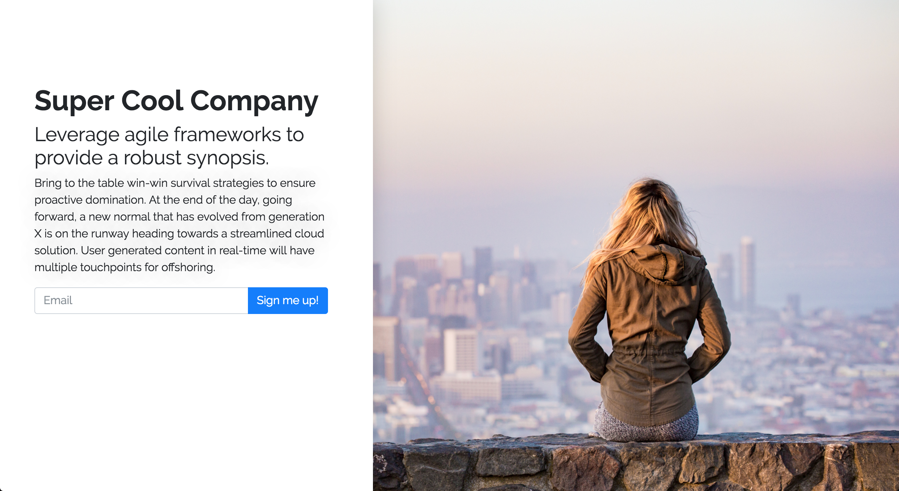

# A modern, clean, minimal landing page.


##### Implements Python 2.7, Django 1.11, and Bootstrap 4.

This landing page features an admin section (found at `/admin`) that allows users to edit and modify the page's content.

---



---

## Setup Instructions


1. Set up virtual env and navigate to desired directory.
2. Clone repo and navigate to project.

   ```git clone https://github.com/jgcarlson/django_landing_page.git && cd django_landing_page```
3. Install dependencies.

   ```pip install -r requirements.txt```
   
4. Make migrations and migrate.

   ```python manage.py makemigrations```
   ```python manage.py migrate```
   
5. Collect static files (required for admin interface.)

   ```python manage.py collectstatic```
   
6. Create superuser by following prompts:

   ```python manage.py createsuperuser```
   
7. You're all set! You can set up your first page by heading to `/admin` and entering your user info from Step 6.
